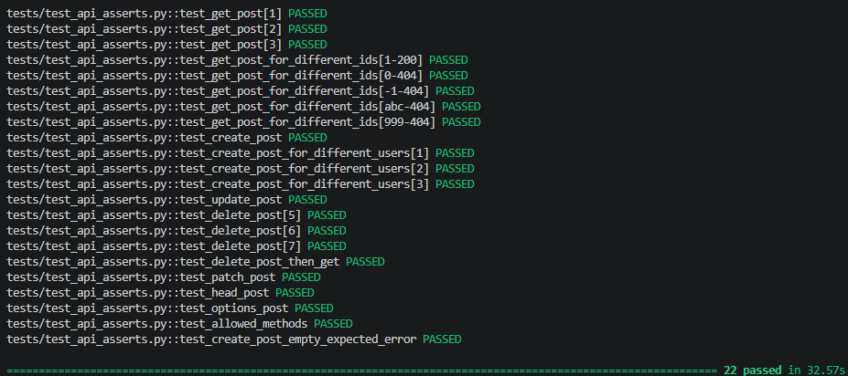

# Портфолио QA инженера

## UI-тесты (SauceDemo)
**Проект:** Автотесты для интернет-магазина https://www.saucedemo.com

### Что покрыто:
- Логин (успешный и неуспешный)
- Добавление товаров в корзину (параметризованный тест)
- Удаление товара из корзины
- Проверка содержимого корзины
- Сквозной сценарий оформления заказа
- Сортировка (A to Z, Z to A)
- Валидация почтового индекса (параметризованный тест)

### Результаты тестов

### Запуск тестов:
1. Установить зависимости: `pip install selenium pytest`
2. Запустить: `pytest test_saucedemo.py -v`

## API-тесты (JSONPlaceholder)
**Проект:** Тестирование REST API https://jsonplaceholder.typicode.com

### Что покрыто:
- GET /posts/{id} — параметризованные тесты (id 1,2,3)
- GET с разными форматами id (0, -1, строка, 999) — проверка статусов
- POST /posts — создание поста (позитивный, с пустым title)
- POST параметризованный по userId (1,2,3)
- PUT /posts/1 — полное обновление поста
- DELETE /posts/1 — удаление поста
- DELETE + GET — проверка, что пост действительно удалён

### Запуск тестов:
1. Установить зависимости: `pip install requests pytest`
2. Запустить: `pytest tests/test_api_asserts.py -v`

### Результаты тестов

## GitHub API-тесты
**Проект:** Тестирование GitHub API (с авторизацией)

### Что покрыто:
- Создание репозитория через POST /user/repos
- Удаление репозитория через DELETE /repos/{owner}/{repo}
- Проверка заголовка Authorization (Bearer token)

### Запуск тестов:
1. `$env:GITHUB_TOKEN="your_token_here"  # Windows PowerShell` или `export GITHUB_TOKEN=your_token_here # Linux/Mac`
2. `pytest tests/test_github_api.py -v`

### Технологии
- Python 3.x
- pytest
- Selenium WebDriver (UI)
- Requests (API)
- GitHub Actions (планируется)
- GitHub API (авторизация через токен, создание/удаление репозиториев)
