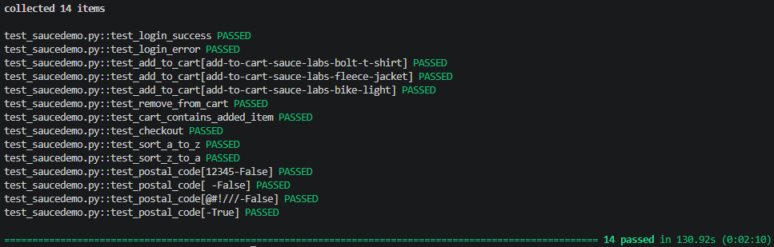

# QA Portfolio

## Тесты для SauceDemo (https://www.saucedemo.com)

### Что покрыто:
- Логин (успешный и неуспешный)
- Добавление товаров в корзину (параметризованный тест)
- Удаление товара из корзины
- Проверка содержимого корзины
- Сквозной сценарий оформления заказа
- Сортировка (A to Z, Z to A)
- Валидация почтового индекса (параметризованный тест)

## Результаты тестов

### Запуск тестов:
1. Установить зависимости: `pip install selenium pytest`
2. Запустить: `pytest test_saucedemo.py -v`

### Технологии
- Python 3.x
- Selenium WebDriver
- pytest
