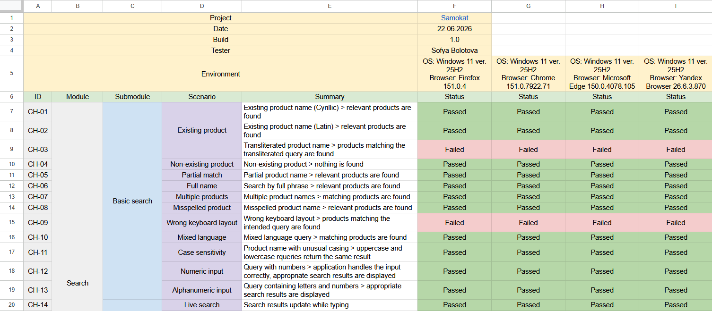
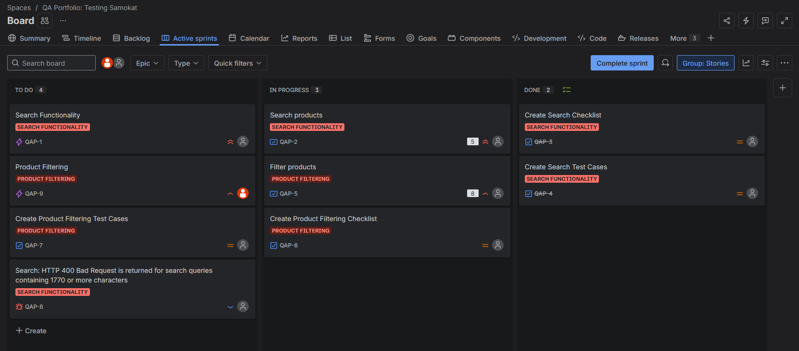
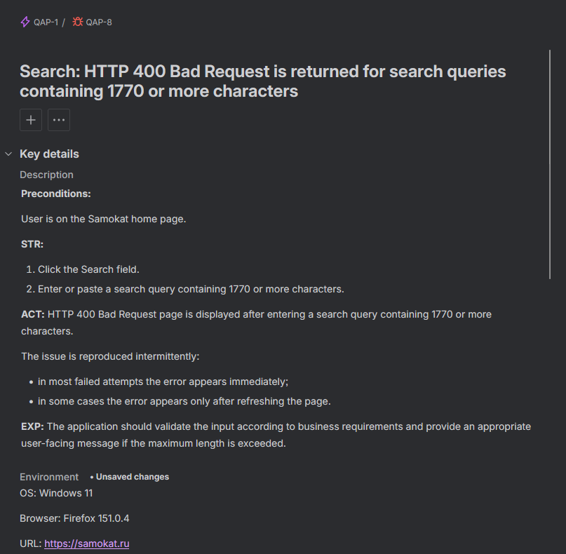
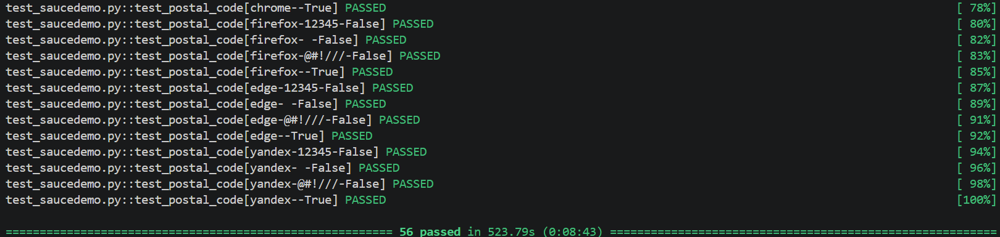
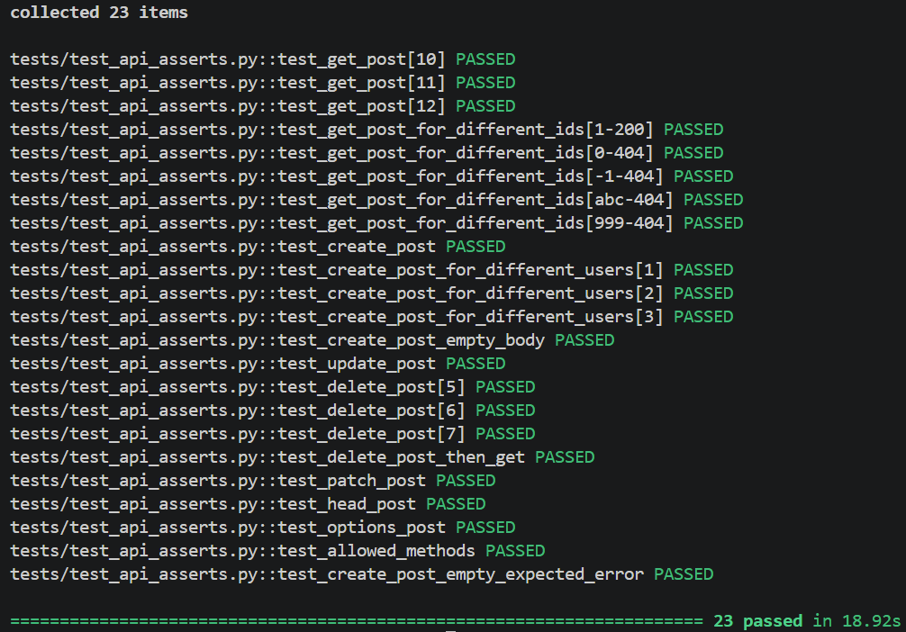
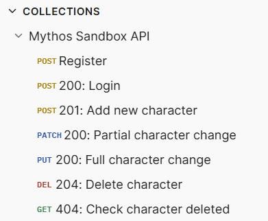
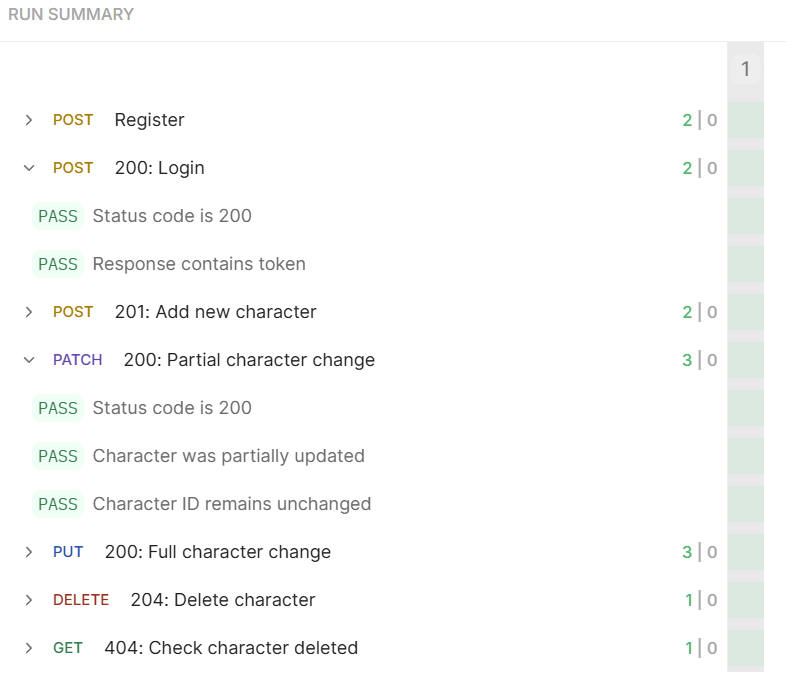

# Портфолио QA инженера

Привет!
Меня зовут **Софья**. Я начинающий QA Engineer.
В этом репозитории представлены мои проекты, демонстрирующие навыки ручного и автоматизированного тестирования веб-приложений.

## Содержание
- [Ручное тестирование (Samokat)](#manual-testing-samokat)
- [UI-тесты (SauceDemo)](#ui-tests-saucedemo)
- [API-тесты (JSONPlaceholder)](#api-tests-jsonplaceholder)
- [GitHub API-тесты](#github-api-tests)
- [Postman API-тесты](#postman-api-tests)
- [Технологии](#technologies)

---

<a id="manual-testing-samokat"></a>
## Ручное тестирование (Samokat)

**Проект:** тестирование функциональности поиска интернет-магазина **Самокат**.

### Что выполнено

- Разработан чек-лист для тестирования функциональности поиска
- Разработаны тест-кейсы
- Проведено функциональное и исследовательское тестирование
- Найден и оформлен дефект в Jira
- Подготовлена тестовая документация

### Артефакты

#### 📄 Чек-лист и тест-кейсы в [Google Sheets](https://docs.google.com/spreadsheets/d/1pLv5iRbkDDxAqSr9MJbao2W-B2_8rGeUqRajbSLZyOA/edit?usp=sharing)

<p align="center">
  <a href="screenshots/checklist.png">
    
  </a>
</p>

#### 🗂 Jira Board

<p align="center">
  <a href="screenshots/jira_board.png">
    
  </a>
</p>

#### 🐞 Bug Report

<p align="center">
  <a href="screenshots/jira_bug_report.png">
    
  </a>
</p>

---

<a id="ui-tests-saucedemo"></a>
## UI-тесты (SauceDemo)

**Проект:** Автотесты для интернет-магазина SauceDemo.

### Ключевые проверки

- Логин (успешный и неуспешный)
- Добавление товаров в корзину (параметризованный тест)
- Удаление товара из корзины
- Проверка содержимого корзины
- Сквозной сценарий оформления заказа
- Сортировка (A to Z, Z to A)
- Валидация почтового индекса (параметризованный тест)

**Кросс-браузерное тестирование:**

Тесты запускаются в следующих браузерах:
- Google Chrome
- Mozilla Firefox
- Microsoft Edge
- Яндекс Браузер (при наличии)

Для Яндекс.Браузера требуется задать переменную окружения `YANDEX_BROWSER_PATH` с путём к исполняемому файлу браузера.

**Результаты тестов:**
<p align="center">
  <a href="screenshots/pytest_results.png">
    
  </a>
</p>

**Запуск тестов:**

1. Установить зависимости:
```pip install selenium pytest webdriver-manager```
2. Запустить тесты:
```pytest test_saucedemo.py -v```
3. Для запуска в конкретном браузере (например, Chrome):
```pytest test_saucedemo.py -k "chrome" -v```
4. Для параллельного запуска (требуется pytest-xdist):
```pip install pytest-xdist```
```pytest -n 4```
   
---

<a id="api-tests-jsonplaceholder"></a>
## API-тесты (JSONPlaceholder)

**Проект:** Тестирование REST API https://jsonplaceholder.typicode.com

### Ключевые проверки

- GET /posts/{id} — параметризованные тесты (id 1,2,3)
- GET с разными форматами id (0, -1, строка, 999) — проверка статусов
- POST /posts — создание поста (позитивный, с пустым title)
- POST параметризованный по userId (1,2,3)
- PUT /posts/1 — полное обновление поста
- DELETE /posts/1 — удаление поста
- DELETE + GET — проверка, что пост действительно удалён

### Запуск тестов

1. Установить зависимости: `pip install requests pytest`
2. Запустить: `pytest tests/test_api_asserts.py -v`

### Результаты тестов

<p align="center">
  <a href="screenshots/pytest_api_results.png">
    
  </a>
</p>

---

<a id="github-api-tests"></a>
## GitHub API-тесты

**Проект:** Тестирование GitHub API (с авторизацией)

### Основные сценарии

- Создание репозитория через POST /user/repos
- Удаление репозитория через DELETE /repos/{owner}/{repo}
- Проверка заголовка Authorization (Bearer token)

### Запуск тестов

1. `$env:GITHUB_TOKEN="your_token_here"  # Windows PowerShell` или `export GITHUB_TOKEN=your_token_here # Linux/Mac`
2. `pytest tests/test_github_api.py -v`

---

<a id="postman-api-tests"></a>
## Postman API-тесты

**Проект:** Коллекция тестов для Mythos Sandbox API

### Ключевые проверки

- Регистрация пользователя
- Авторизация с сохранением токена в переменную коллекции
- Создание персонажа (автоматическое сохранение ID)
- Частичное и полное изменение персонажа (PATCH, PUT)
- Удаление персонажа

### Особенности

- Автоматическое сохранение токена из ответа `/login` в переменную коллекции
- Автоматическое сохранение ID созданного персонажа для использования в следующих запросах
- Цепочка запросов: регистрация → логин → создание → изменение → обновление → удаление
- Тесты на статус-коды и структуру ответов

### Скриншоты

#### Коллекция запросов в Postman

<p align="center">
  <a href="screenshots/postman_collection.png">
    
  </a>
</p>

#### Результат выполнения тестов

<p align="center">
  <a href="screenshots/postman_runner.png">
    
  </a>
</p>

### Как запустить

1. Импортировать коллекцию в Postman
2. Запустить коллекцию через Postman Runner

### Артефакты

📁 [Коллекция Postman](postman/mythos_sandbox_collection.json)

---

<a id="technologies"></a>
## Технологии

### Язык программирования

- Python

### Автоматизация тестирования

- pytest
- Selenium WebDriver
- Requests

### Инструменты

- Git
- GitHub
- Jira
- Google Sheets
- Postman

### CI/CD

- GitHub Actions
